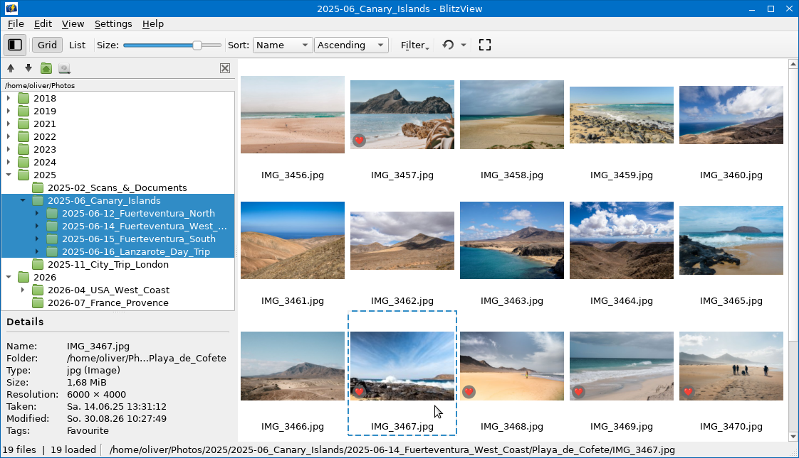

# ⚡ BlitzView 

[](../../actions/workflows/ci.yml)
[](LICENSE)

A directory oriented fast image and video browser.

Pick a folder, several folders, or a whole tree; BlitzView shows the images and
videos in them as a single grid. It keeps no library and no database, so there
is nothing to import and nothing to keep in sync.



> **Note:** this screenshot shows an early working version — the project is
> still in active development and the interface may change.

## Download

To get a first impression, try the
[portable builds for Linux, Windows and macOS](../../releases/tag/latest-dev)
— unzip and run, nothing is installed. These are snapshots of the latest
development commit; there are no version-tagged releases or distribution
packages yet.

## Features

- **Grid and table view** over the same set of files, with sorting and filtering.
- **Fast thumbnails** — background loading, prefetching, and an on-disk cache,
  so scrolling stays smooth in large directories.
- **Directory tree** with recursive or individual selection of any number of
  folders, plus automatic detection of USB drives and other removable media.
- **Fullscreen viewer** for images and videos, with zoom and pan.
- **Metadata** (optional, via `exiftool`): capture time, and user tags you can
  edit, assign, and filter by.
- **Video thumbnails** extracted with FFmpeg.
- Live sync: the view follows changes on disk while it is open.

## Building

Requirements: **Qt 6** (Core, Gui, Widgets, Multimedia, MultimediaWidgets,
OpenGLWidgets, Concurrent — plus DBus on Linux), **FFmpeg** development
headers, **CMake ≥ 3.19**, and a C++17 compiler.

```sh
git clone https://github.com/blitzview-org/blitzview.git
cd blitzview
make release
```

This configures and builds `build/release/blitzview`. Plain CMake works just as
well — `build/` holds one subdirectory per build type, so give it its own:

```sh
cmake -B build/release -DCMAKE_BUILD_TYPE=Release && cmake --build build/release
```

See the `Makefile` for the other targets — `make build` for a Debug build in
`build/debug`, and `make linux-portable` / `make windows-portable` /
`make macos-portable` for the self-contained portable packages. The
Linux/Windows targets cross-build inside a container and therefore need
**podman** plus a one-time `make build-image`; the macOS target instead
requires running natively on a Mac.

Runtime dependency (optional): `exiftool` for capture time and tags. Without
it, BlitzView runs normally and only the metadata features are unavailable.

## License

Copyright © 2026 Oliver Schmidt

This program is free software: you can redistribute it and/or modify it under
the terms of the [GNU General Public License](https://www.gnu.org/licenses/gpl-3.0.html)
as published by the Free Software Foundation, either version 3 of the License,
or (at your option) any later version.

This program is distributed in the hope that it will be useful, but WITHOUT ANY
WARRANTY; without even the implied warranty of MERCHANTABILITY or FITNESS FOR A
PARTICULAR PURPOSE.

BlitzView links dynamically against Qt (LGPL v3) and FFmpeg (LGPL v2.1). The
license texts of every bundled third-party component, together with the
corresponding source offers, are in [`licenses/`](licenses/) and ship inside
the portable packages.
